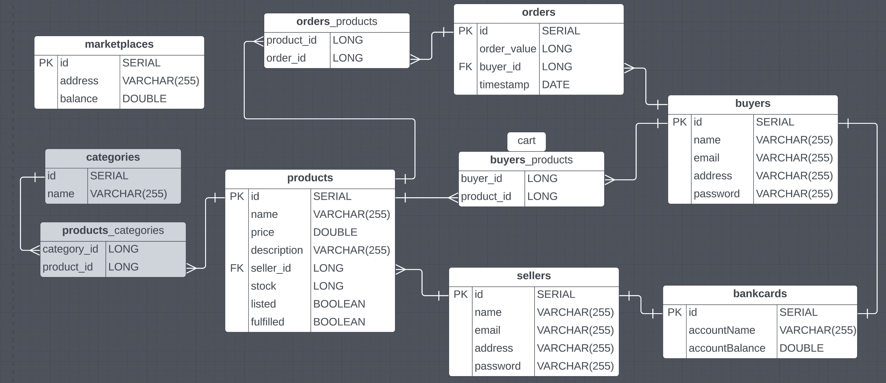
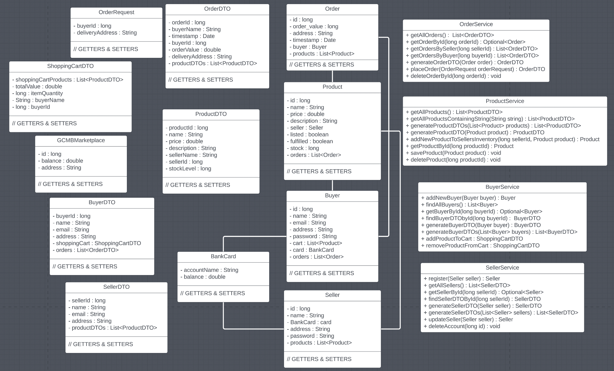

# **E-Commerce Platform Backend Project (BNTA) 🛍**

## **GRECHIMO code team**

## **_Collaborators_**

- Greg Court (GitHub: [Greg-Court](https://github.com/Greg-Court))
- Chinika Charles (GitHub: [ChinikaC](https://github.com/ChinikaC))
- Mohamed Abdi (GitHub: [mohincode](https://github.com/mohincode))

<hr />

## **TABLE OF CONTENTS** 📖

> 1. Project Overview
> 2. Project Timeline
> 3. Diagrams
> 4. Technologies
> 5. Dependencies
> 6. The API
> 7. Challenges
> 8. Future

<hr />

### **_1. Project Overview_**

Our team took a keen interest in online marketplaces such as eBay and Amazon, which allow individuals and businesses to buy and sell a wide variety of goods and services. We specifically chose this task as we wanted our API to encompass a range of our learning with the potential to further extend it.

To establish a sense of identity, we named our team GRECHIMO BAY, which relates to each of our three first names and incorporates the "bay" terminology commonly used for marketplaces such as eBay.

<hr />

### **_2. Project Timeline_**

- Monday 20/02/2023 - Met with the team to discuss ideas and started UML and ERD diagrams.
- Tuesday 21/02/2023 - Started on our set MVP using IntelliJ and Git.
- Wednesday 22/02/2023 - Alot of debugging and started working in our extension tasks.
- Thursday 23/02/2023 - Completed MVP, Fixed errors and preparing presentation.
- Friday 24/02/2023 - Presentation.

<hr />

### **_3. Diagrams_**

ERD:



This displays what are MVP was. The 'categories' and join table 'products_categories' was an extension that we did not manage to get onto (hence why they are in grey).

- There are two join tables: orders_products and buyers_products
- 'Marketplaces' was included and was set up as 'GCMBMarketplace.java' but did was not used. Please see 'Seller fees' under the 'Future' section to find out what we wanted to do with this model

UML:



We included all of our models, DTOs and the service layer with lines to indicate which models have a relationship with one another. All of our properties and methods can be found in the above diagram.

<hr />
 
### ***4. Technologies***

We utilized Java to code our API and Git to commit changes and store our code on GitHub, along with UML and ERD diagrams. The platform proved to be very helpful in keeping track of our modifications and allowing us to revert to previous versions of the code if needed.

Spring Initializr was an essential tool that allowed us to implement dependencies to utilize particular functions and commands. For instance, we utilized Spring Boot to implement the Spring framework, JPA to convert JSON and Java, and SQL to manage our relational databases and perform various operations on the data in them. We collaborated in IntelliJ using the Git framework to work on separate branches and later combine and collaborate on each other's code. Finally, we used Postman to test our functions and used Postico to view our database table.

These platforms allowed us to test our code and import a variety of functions to create our tables and extend our beans (examples: @JPARepositories, @Component, etc.).

<hr />

### **_5. Dependencies_**

- spring-boot-starter-data-jpa: This dependency enabled us to use Java Persistence API (JPA) to interact with our relational database and perform various operations on the data. It provided us with an easy-to-use, high-level API for managing our data.

- spring-boot-starter-web: This dependency enabled us to build a RESTful web API using the Spring framework. It provided us with the necessary components to handle HTTP requests and responses, and to implement controllers, services, and other components that make up the API.

- spring-boot-devtools: This dependency provided us with additional tools for development, such as automatic restart of the application when code changes are detected, and live reloading of static resources.

- postgresql: This dependency provided us with the necessary components to interact with a PostgreSQL database, including the JDBC driver and other utilities.

- spring-boot-starter-test: This dependency provided us with a suite of testing tools and frameworks for testing our application, including JUnit, Mockito, and Spring Test. It enabled us to write and run tests for our API to ensure that it was functioning correctly and that changes did not introduce regressions. Unfortunately, due to time limitations, we were unable to perform JUnit testing on this occasion.

```
<dependency>
  <groupId>org.springframework.boot</groupId>
  <artifactId>spring-boot-starter-data-jpa</artifactId>
</dependency>
<dependency>
  <groupId>org.springframework.boot</groupId>
  <artifactId>spring-boot-starter-web</artifactId>
</dependency>
<dependency>
  <groupId>org.springframework.boot</groupId>
  <artifactId>spring-boot-devtools</artifactId>
  <scope>runtime</scope>
  <optional>true</optional>
</dependency>
<dependency>
  <groupId>org.postgresql</groupId>
  <artifactId>postgresql</artifactId>
  <scope>runtime</scope>
</dependency>
<dependency>
  <groupId>org.springframework.boot</groupId>
  <artifactId>spring-boot-starter-test</artifactId>
  <scope>test</scope>
</dependency>

```

<hr />

### **_6. The API_**

<table>
  <tr>
    <th>Request Type</th>
    <th>PATH</th>
    <th>Description</th>
    <th>Sample Input</th>
  </tr>
  <tr>
    <td>GET</td>
    <td>/products</td>
    <td>Returns a list of all products (via ProductDTOs) available to purchase on the marketplace</td>
  </tr>
  <tr>
    <td>GET</td>
    <td>/products?sort=price-asc</td>
    <td>Returns a list of all products (via ProductDTOs) available to purchase on the marketplace, sorted by price ascending</td>
  </tr>
  <tr>
    <td>GET</td>
    <td>/products?sort=price-desc</td>
    <td>Returns a list of all products (via ProductDTOs) available to purchase on the marketplace, sorted by price descending</td>
  </tr>
  <tr>
    <td>GET</td>
    <td>/products?sort=name-asc</td>
    <td>Returns a list of all products (via ProductDTOs) available to purchase on the marketplace, sorted by name ascending</td>
  </tr>
  <tr>
    <td>GET</td>
    <td>/products?sort=name-desc</td>
    <td>Returns a list of all products (via ProductDTOs) available to purchase on the marketplace, sorted by name descending</td>
  </tr>
  <tr>
    <td>GET</td>
    <td>/products?searchQuery=...</td>
    <td>Returns a list of all products (via ProductDTOs) available to purchase on the marketplace containing a specified search term</td>
  </tr>
  <tr>
    <td>POST</td>
    <td>/products?sellerId=:id</td>
    <td>Allows a specific seller to create a new product. Product variables to be passed through via requestBody in JSON. No properties are mandatory (can create a product with as little as a single property).</td>
    <td>
    <pre><code>{
    "name": "testName",
    "stock": 500,
    "price": 49.99
}</code></pre>
    </td>
  </tr>
  <tr>
    <td>PATCH</td>
    <td>/products/update/:id?...</td>
    <td>Enables updating of exisitng product listings, allowing modification of any property via requestParams</td>
    <td>/products/update/1?price=3645.22</td>
  </tr>
  <tr>
    <td>DEL</td>
    <td>/products/:id</td>
    <td>Deletes specified product. Warning - in its current implementation, any related orders that contain product to delete will also be deleted.</td>
  </tr>
  <tr>
    <td>GET</td>
    <td>/buyers</td>
    <td>Returns a list of all buyers (via BuyerDTOs) currently registered on the marketplace</td>
  </tr>
  <tr>
    <td>GET</td>
    <td>/buyers/:id</td>
    <td>Returns a BuyerDTO for the specified buyerId</td>
  </tr>
  <tr>
    <td>GET</td>
    <td>/buyers/:id/admin</td>
    <td>Returns the entire Buyer object for the specified buyerId</td>
  </tr>
  <tr>
    <td>GET</td>
    <td>/buyers/:id/cart</td>
    <td>Returns a ShoppingCartDTO for the specified buyerId</td>
  </tr>
  <tr>
    <td>PUT</td>
    <td>/buyers/:id</td>
    <td>Allows a buyer to replace their account bank card witha new one - accountName and accountBalance must be passed through via JSON</td>
    <td>
    <pre><code>{
    "accountName": "jimmy",
    "accountBalance": 100
}</code></pre>
    </td>
  </tr>
  <tr>
    <td>POST</td>
    <td>/buyers</td>
    <td>Register a new buyer - parameters must be passed through via JSON. Card required</td>
    <td>
    <pre><code>{
    "name": "jimmy",
    "email": "jimmy@test.com",
    "address": "123 fake street",
    "password": "secretpassword123",
    "card": {
            "accountName": "jimmy",
            "accountBalance": 10000
        }
}</code></pre>
    </td>
  </tr>
  <tr>
    <td>PATCH</td>
    <td>/buyers/:id/product/:id</td>
    <td>add a specific product to a specific buyer's cart - returns a ShoppingCartDTO</td>
  </tr>
  <tr>
    <td>DEL</td>
    <td>/buyers/:id/product/:id/remove</td>
    <td>remove a specifid product from a specifi buyer's cart - returns a ShoppingCartDTO</td>
  </tr>
  <tr>
    <td>PATCH</td>
    <td>/buyers/:id?...</td>
    <td>Allows buyer to update their details via RequestParams</td>
    <td>/buyers/1?name=john</td>
  </tr>
  <tr>
    <td>DEL</td>
    <td>/buyers/:id</td>
    <td>Deletes a buyer from the database</td>
  </tr>
  <tr>
    <td>GET</td>
    <td>/orders</td>
    <td>Returns a list of all marketplace orders (via OrderDTOs)</td>
  </tr>
  <tr>
    <td>GET</td>
    <td>/orders?sellerId=:id</td>
    <td>Returns a list of all marketplace orders (via OrderDTOs) that contains items sold by a specified seller</td>
  </tr>
  <tr>
    <td>GET</td>
    <td>/orders?buyerId=:id</td>
    <td>Returns a list of all marketplace orders (via OrderDTOs) placed by a specific buyer</td>
  </tr>
  <tr>
    <td>POST</td>
    <td>/orders</td>
    <td>Place an order - buyerId and deliveryAddress must be passed through via JSON. Takes cart items from specified buyer's cart and creates a new order with those items and the specified delivery address.</td>
        <td>
    <pre><code>{
    "buyerId": 1,
    "deliveryAddress": "50 Fake Street"
}</code></pre>
    </td>
  </tr>
  <tr>
    <td>DEL</td>
    <td>/orders:id</td>
    <td>Delete an order</td>
  </tr>
  <tr>
    <td>GET</td>
    <td>/sellers</td>
    <td>Returns a list of all registered sellers via SellerDTOs</td>
  </tr>
  <tr>
    <td>GET</td>
    <td>/sellers/:id</td>
    <td>Returns a SellerDTO for the specified seller</td>
  </tr>
  <tr>
    <td>GET</td>
    <td>/sellers/:id/admin</td>
    <td>Returns the entire Seller object for the specified seller</td>
  </tr>
  <tr>
    <td>POST</td>
    <td>/sellers</td>
    <td>Create a new seller. Seller properties to be passed through via JSON. Card required</td>
    <td>
    <pre><code>{
    "name": "jimmy",
    "email": "jimmy@test.com",
    "address": "123 fake street",
    "password": "secretpassword123",
    "card": {
            "accountName": "jimmy",
            "accountBalance": 10000
        }
}</code></pre>
    </td>
  </tr>
  <tr>
    <td>PATCH</td>
    <td>/sellers/:id</td>
    <td>Update a seller's details Properties to be passed through via JSON</td>
    <td>
        <pre><code>{
    "name" : "Aaliyah"
}</code></pre>
    </td>
  </tr>
  <tr>
    <td>DEL</td>
    <td>/sellers/:id</td>
    <td>Delete a specific seller</td>
  </tr>
</table>

<hr />

### **_7. Challenges_**

- One of our challenges was familiarizing ourselves with new beans (@Transient) and functionalities we included to assist with CRUD tasks, specifically allowing users to delete products from their cart. We researched how to resolve the issue and soon completely understood and were able to effectively execute a working MVP we could build on.

- Another challenge was with our @DELETE requests. Having many-to-many and one-to-many relationships meant there were a lot of associations so it was hard to simply delete one thing, for example, deleting a product as it was included in an order. We ended up using 'cascade = CascadeType.ALL' in the @ManyToMany annotation in the 'Product.java' which solved our issues with the @DELETE requests. However, when we delete a product now, it also deletes the whole order that the product was in, which is something we did not know how to resolve.

- We also encountered issues when attempting to create a new buyer due to the cart. When a new buyer is created, they have an empty cart, but when we were trying to create the buyer an error appeared which stated that the cart was null. To resolve this, we had to pass the cart into the default constructor in buyer.java and this initialised the empty cart ArrayList.

<hr />

### **_8. Future_**

If granted more time, we would have liked to develop more functions to create additional features. These include:

- Bidding functionality: Giving sellers the opportunity to list products to be bid on among buyers with a specified timescale for when bids will no longer be accepted.
- Categories: An ENUM for categories would enable the buyer to have greater control over which products are displayed to them.
- More robust deletion: Currently, when a product is deleted, any order that it is associated with is also deleted. Given more time, we would have removed the association with the order prior to deletion.
- Add "quantity" field to orders: Currently, when an order is placed, if there are multiple of the same item, they are each added as their own object. We would like to add a "quantity" counter to order products to avoid duplication of items.
- Seller fees: Letting the marketplace take a cut of seller revenue would be advisable in order to make the marketplace profitable.
